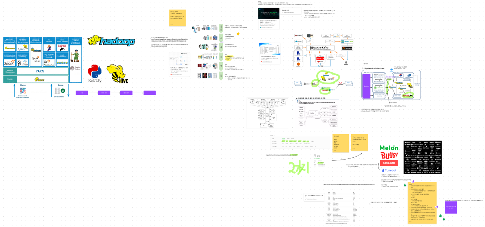

# 빅데이터 프로그래밍 빅품 팀 회의

2023년 11월 20일 / 22시 / 온라인 Google Meet

## 회의 안건

### todo 결정 회의

1. 전체적인 구조 구상하기
   1. 데이터 소스  
      -멜론, 벅스, 스포티파이, 애플뮤직 등등....  
      -BPMSONG 등등 bpm 나와있는 사이트 tunebat
   2. 수집 → 크롤링  
      -beautifulsoup4  
      -selenium
      ...
   3. 저장 -저장-> HDFS에 한다. -여기서 어떤기술 사용?
   4. 처리  
      -mapreduce  
      -hive: 데이터 정형화, 전처리 이런 느낌  
      -spark
   5. 분석  
      -여기서 가중치 계산  
      -추천 가사 순위 매기기  
      -감성분석 등등(이건 안할 수도 있음)
   6. 표현  
      -그냥 결과로 보여준다  
      (알아서 단어 선택, 조합해서 가사 만들게끔 가이드 제공)
2. todo 정하기

   1. 음원사이트 크롤링 방법 찾아보고 샘플데이터 조사해보기

      [음원사이트에서 조사할 항목] -수집데이터: 1년 안에 발매된 한국 음악의 장르(일부만 골라서 크롤링),  
      -조사기관: 멜론, 벅스 등, 애플 뮤직 등  
      -장르  
      -제목  
      -솔로/그룹  
      -평점(곡에 대한 평점)  
      -출시 일자  
      -bpm(tunebat)  
      -차트순위?(일일차트, 월간차트. ..?)

      나머지는 이 데이터를 어떻게 가공, 정제할 건지  
      그리고 이 데이터를 어떤 시스템을 이용해서 저장, 처리, 분석, 표현할건지 조사  
      다음시간에 아키텍쳐 다이어그램 완성(여기:figjam에서)

      각 기술에 대한 용도나 시스템에 어떻게 적용시킬지 알아와서 노션 같은 곳에 적어두기

3. 정기 회의 날짜 정하기 - > 정기회의시간 정하기<-: 매주 월요일 10시30분~
   

### 다음 회의 안건

- 정제 데이터 활용 빅데이터 분석 진행
